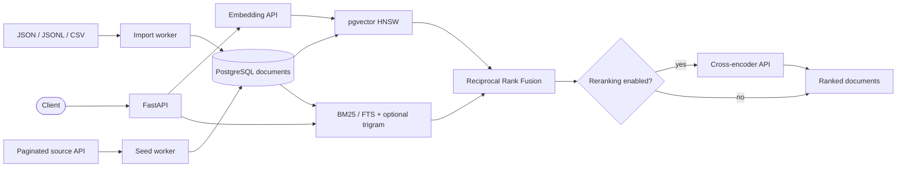

<p align="center">
  
</p>

<h1 align="center">Rimuru Search</h1>

<p align="center">
  <strong>Run hybrid search locally. Scale it to production.</strong><br>
  BM25, pgvector, RRF, and reranking—in one self-hosted PostgreSQL stack.
</p>

<p align="center">
  <a href="https://github.com/Ryotess/rimuru-search/actions/workflows/ci.yml"></a>
  <a href="https://www.python.org/downloads/release/python-3130/"></a>
  <a href="LICENSE"></a>
  <a href="https://docs.astral.sh/ruff/"></a>
</p>

Rimuru Search is a self-hosted hybrid search service built with PostgreSQL BM25,
pgvector, Reciprocal Rank Fusion, and optional reranking. Bring JSON, JSONL, CSV,
or a paginated API, then run the same stack locally or on your own production
infrastructure. OpenAI-compatible model APIs keep embedding and reranking
providers swappable.

## Why Rimuru Search

**Absorb every signal. Return the best results.**

| Capability | What it provides |
| --- | --- |
| Hybrid retrieval | PostgreSQL BM25 and pgvector HNSW candidate retrieval |
| Better ranking | RRF candidate fusion plus optional cross-encoder reranking |
| Your data model | Collection-scoped documents with configurable JSON, JSONL, and CSV field mapping |
| Safe replacement | Idempotent upserts or atomic staging-table snapshot swaps |
| Swappable models | OpenAI-compatible embedding and reranking interfaces |
| Production foundation | Readiness checks, database pooling, Redis caching, distributed locks, and safe ingestion |

## Architecture



The search path is intentionally composable: lexical and vector retrieval can be
tuned independently, reranking can be disabled, and Redis is optional. Document
identity is always `(collection, id)` so tenants or datasets remain isolated
through search, import, caching, and fusion.

## Quick start

You need Docker with Compose v2, GNU Make, and at least 8 GB of memory allocated
to Docker.
The first run downloads the CPU vLLM image and roughly 1 GB of model files.

```bash
git clone https://github.com/Ryotess/rimuru-search.git
cd rimuru-search
make demo-up
```

`make demo-up` builds the application, starts PostgreSQL, Redis, a generated
sample source, and two CPU model servers, applies migrations, imports eight sample
documents, and waits for the complete search path to become healthy.

| Endpoint | URL |
| --- | --- |
| Demo UI | <http://localhost:8000/v1/search/demo> |
| OpenAPI | <http://localhost:8000/docs> |
| Readiness | <http://localhost:8000/health/ready> |

Run a search:

```bash
curl -X POST http://localhost:8000/v1/search \
  -H 'Content-Type: application/json' \
  -d '{"query":"How can I combine keyword and semantic search?","rerank_top_n":5}'
```

Stop the demo without deleting its database or model cache:

```bash
make demo-status
make demo-logs
make demo-down
```

> [!CAUTION]
> `make demo-reset` deletes the demo database and downloaded model-cache volumes.

## Search your own data

Rimuru Search accepts JSON, JSONL, and CSV. The smallest native document shape is:

```json
{
  "id": "article-42",
  "content": "How battery storage supports an electricity grid",
  "metadata": {"category": "energy", "language": "en"}
}
```

| Field | Required | Meaning |
| --- | --- | --- |
| `collection` | no | Advanced logical namespace for hosting multiple searchable datasets in one service. Most single-file users should omit it and use the default collection. |
| `id` | yes | Stable document identifier within its collection. The same ID may exist in another collection because identity is `(collection, id)`. |
| `content` | yes | Text used by lexical search, embeddings, and reranking. Put every field that should affect relevance here. |
| `metadata` | no | JSON returned with the result and available through `metadata_filter`. It is not embedded or added to lexical search. |

For a single uploaded dataset, omit `collection` in both imports and searches;
Rimuru Search uses `DOCUMENT_DEFAULT_COLLECTION` (`default`) automatically. An
explicit collection becomes useful only when the same service later hosts
multiple independently searched corpora—for example, a product catalog and a
help center. In that case, `("products", "item-42")` and
`("help-center", "item-42")` are independent documents, and each request chooses
which corpus to search. Collection is a retrieval namespace, not an
authentication or authorization boundary.

Start the service and import a file in one command:

```bash
make start FILE=./documents.jsonl
```

If you already ran `make demo-up`, its sample documents remain in the default
collection. Import your data into a named collection and search that collection,
or use the service-wide `replace` mode below when your file contains every
document you intend to keep.

```bash
make start FILE=./documents.jsonl ARGS='--collection my-data'
```

Source fields can be mapped without code. For a CSV containing
`sku,title,description,category,language`, configure `.env` like this:

```dotenv
IMPORT_ID_FIELD=sku
IMPORT_CONTENT_FIELDS=title,description
IMPORT_METADATA_FIELDS=category,language
DOCUMENT_DEFAULT_COLLECTION=products
IMPORT_MODE=upsert
```

```bash
make start FILE=./products.csv
```

`upsert` adds new IDs and updates matching IDs. For a complete snapshot, use
`ARGS='--mode replace'`: Rimuru Search builds a staging table and swaps it into
place only after every row is embedded successfully. Validate a mapping without
writing with `ARGS='--dry-run'`.

> [!WARNING]
> `replace` and `RESEED` replace the complete service-wide document snapshot,
> including every collection. Their input must contain all collections you want
> to keep. Use `upsert` for collection-by-collection updates.

See [Data import](docs/importing-data.md) for nested fields, generated IDs, native
execution, dump/load, and source API ingestion.

## Search API

```bash
curl -X POST http://localhost:8000/v1/search \
  -H 'Content-Type: application/json' \
  -d '{
    "query": "grid electricity",
    "collection": "articles",
    "document_ids": ["article-42", "article-108"],
    "metadata_filter": {"language": "en"},
    "vector_top_k": 100,
    "lexical_top_k": 100,
    "rrf_top_k": 15,
    "rerank_top_n": 3
  }'
```

The response exposes the final order together with the signals used to produce it:

```json
{
  "query": "grid electricity",
  "collection": "articles",
  "hits": [
    {
      "collection": "articles",
      "id": "article-42",
      "content": "How battery storage supports an electricity grid",
      "metadata": {"category": "energy", "language": "en"},
      "rrf_score": 0.0325,
      "vector_rank": 1,
      "vector_distance": 0.12,
      "lexical_rank": 2,
      "lexical_score": 0.8,
      "rerank_score": 0.94
    }
  ]
}
```

- `POST /v1/search` returns ranked documents and retrieval details.
- `POST /v1/search/ids` returns only ordered IDs for compact integrations.
- `POST /v1/search/details` is a deprecated alias of the main route.
- `GET /v1/search/demo` serves the bundled browser UI.

`collection` defaults to `DOCUMENT_DEFAULT_COLLECTION`. `document_ids` and
`metadata_filter` restrict both retrieval branches within that collection.

### Tune result quality

The four candidate limits control different stages of the pipeline:

| Parameter | Default | Increase it when | Main tradeoff |
| --- | ---: | --- | --- |
| `vector_top_k` | `100` | Relevant results use different words from the query | More ANN database work |
| `lexical_top_k` | `100` | Exact names, codes, or rare keywords are being missed | More lexical database work |
| `rrf_top_k` | `15` | Good candidates are fused but removed before reranking | More cross-encoder work |
| `rerank_top_n` | `3` | The client needs more final results | Larger response; capped by fused candidates |

BM25 is the default lexical backend; operators can set
`SEARCH_LEXICAL_BACKEND=fts` as an explicit fallback. `use_fuzzy=true` adds
trigram matching for typos and spelling variations to either backend.
`min_similarity` is its `0.0`–`1.0` threshold: lower values improve recall but
admit more noise. Use `bypass_cache=true` during evaluations so each request runs
the current pipeline instead of reading a cached response.

For tuning recipes, score interpretation, latency guidance, and the algorithms
behind each stage, read the [Search tuning guide](docs/search-tuning.md). It links
to pg_textsearch BM25, PostgreSQL full-text and trigram documentation, pgvector's
HNSW guidance, the original RRF paper, and a cross-encoder retrieve-and-rerank
walkthrough.

## Ingestion semantics

Rimuru Search never imports data during FastAPI startup. A user must explicitly
import a file or submit a seeding operation.

| Operation | Destination | Existing IDs | Missing source IDs | On failure |
| --- | --- | --- | --- | --- |
| `SEED` / `upsert` | Live table | Updated | Preserved | Committed batches remain and the checkpoint can resume |
| `RESEED` / `replace` | Fresh staging table | Replaced | Removed across every collection at swap | The live table remains unchanged until the atomic swap |

Submit and inspect a source API seeding task:

```bash
curl -X POST http://localhost:8000/v1/seeding/tasks \
  -H 'Content-Type: application/json' \
  -d '{"operation":"SEED"}'

curl http://localhost:8000/v1/seeding/tasks
curl http://localhost:8000/v1/seeding/tasks/{task_id}
```

FastAPI restarts do not automatically resume interrupted work. Submitting the
same operation explicitly resumes its latest `INTERRUPTED` task; submit with
`"force": true` to cancel that checkpoint and start over. Successful live
seed/reseed operations invalidate cached search responses.

### Source API contract

The seeder requests:

```http
GET {SOURCE_API_BASE_URL}{SOURCE_API_DOCUMENTS_PATH}?page=1&limit=2000
```

Each response must use this envelope:

```json
{
  "data": {
    "list": [
      {
        "collection": "articles",
        "id": "article-42",
        "content": "How battery storage supports an electricity grid",
        "metadata": {"category": "energy", "language": "en"}
      }
    ],
    "meta": {
      "page": 1,
      "take": 1,
      "itemCount": 1,
      "pageCount": 1,
      "hasPreviousPage": false,
      "hasNextPage": false
    }
  }
}
```

The four domain-neutral fields are `collection`, `id`, `content`, and `metadata`.
The bundled [`examples/sample_source_api.py`](examples/sample_source_api.py) is a
minimal working implementation.

## Configuration

Defaults are usable locally without a `.env` file. Copy
[.env.example](.env.example) when you want to override them:

```bash
cp .env.example .env
make config   # show effective settings with credentials redacted
make doctor   # check Python, Docker, Compose, and model dimensions
```

| Setting | Purpose |
| --- | --- |
| `GLOBAL_DATABASE_URL` | PostgreSQL connection URL |
| `EMBEDDING_MODEL_ID`, `RERANKER_MODEL_ID` | Bundled vLLM model IDs and default requested names |
| `RERANKER_REMOTE_CODE_FLAG` | Keep `--no-trust-remote-code` unless a reviewed custom-code reranker requires explicit trust |
| `EMBED_HOSTED_VLLM_API_BASE`, `RERANKER_HOSTED_VLLM_API_BASE` | Native OpenAI-compatible model endpoints |
| `VDB_EMBEDDING_DIM` | Embedding dimension; the schema defaults to `1024` |
| `DOCUMENT_DEFAULT_COLLECTION` | Namespace used when a request omits `collection` |
| `CORS_ALLOWED_ORIGINS`, `CORS_ALLOW_CREDENTIALS` | Browser origins and credential behavior; CORS is not authentication |
| `SEARCH_LEXICAL_BACKEND` | Operator-selected lexical backend: `bm25` (default) or `fts` |
| `SEARCH_*` | Retrieval, fusion, and reranking defaults |
| `IMPORT_*`, `SEED_*` | Field mapping, write mode, batching, and concurrency |
| `CACHE_REDIS_URL`, `CACHE_TTL_SECONDS` | Optional response cache and distributed seeding lock |
| `SOURCE_API_*` | Paginated source API location and path |

The initial migration creates a 1,024-dimensional vector column. A model with a
different output dimension requires a schema migration, a matching
`VDB_EMBEDDING_DIM`, and regenerated embeddings.

The bundled models are English-oriented demo defaults. Multilingual and
domain-specific deployments should evaluate compatible embedding and reranking
models and, when needed, a language-aware PostgreSQL text-search configuration.

See [Configuration](docs/configuration.md) for the complete matrix and external
model examples, [Model compatibility](docs/model-compatibility.md) before
changing models, and [Troubleshooting](docs/troubleshooting.md) for common
failures.

## Native development

Install Python 3.13, [uv](https://docs.astral.sh/uv/), and Docker:

```bash
cp .env.example .env
make install
make host-db
make migrate-db
```

Then use separate terminals:

```bash
make sample-source  # source API on :3000
make serve-vllm     # embedding on :5678, reranker on :5679
make run            # FastAPI on :8000
```

Quality checks:

```bash
make lint
make typecheck
make test
```

Additional commands include `make format`, `make pressure-test`,
`make smoke-models`, `make dump-db`, and `make seed-from-dump`. The pressure test
is a local smoke test, not a capacity certification.

## Documentation

- [Configuration reference](docs/configuration.md)
- [Search tuning guide](docs/search-tuning.md)
- [Importing data](docs/importing-data.md)
- [Model compatibility](docs/model-compatibility.md)
- [Microservice deployment considerations](docs/deployment.md)
- [Troubleshooting](docs/troubleshooting.md)
- [Public release checklist](docs/PUBLISHING.md)

## Production use and boundaries

Rimuru Search can run as a production search service. Its core includes
dependency readiness, database pooling, collection isolation, optional Redis
caching, multi-instance seeding coordination, resumable upserts, and atomic
snapshot replacement. The platform-neutral deployment contract is documented in
[Microservice deployment](docs/deployment.md).

The repository intentionally does not prescribe the production perimeter. Bring
your own authentication, authorization, TLS termination, rate limiting, secret
management, backups, observability, resource policies, and deployment platform.
Review CORS, network exposure, data handling, and logging for your environment.

The GitHub Actions workflow performs CI only: lock validation, linting,
formatting, type checking, Compose validation, tests, and a PostgreSQL BM25/FTS
migration smoke test. It does not publish images or deploy infrastructure.

## Name and artwork

The name is inspired by Rimuru's ability to absorb different inputs, analyze
them, and synthesize something stronger. The code and visual identity are
original; this independent project is not affiliated with or endorsed by any
anime publisher or rights holder.

## Contributing and security

Contributions are welcome. Read [CONTRIBUTING.md](CONTRIBUTING.md) before opening
a pull request. Report vulnerabilities through the private process in
[SECURITY.md](SECURITY.md), not a public issue.

If this source originated in another organization, complete the ownership,
sanitization, and clean-history steps in [docs/PUBLISHING.md](docs/PUBLISHING.md)
before making it public. The existing Git history is intentionally not considered
safe to publish.

## Maintainer and contributors

Maintained by [@Ryotess](https://github.com/Ryotess).

<a href="https://github.com/Ryotess/rimuru-search/graphs/contributors">
  
</a>

The avatar wall updates from the repository's contributor data after commits
reach the default branch. Contributions of all kinds are welcome.

## License

Licensed under the [Apache License 2.0](LICENSE).
